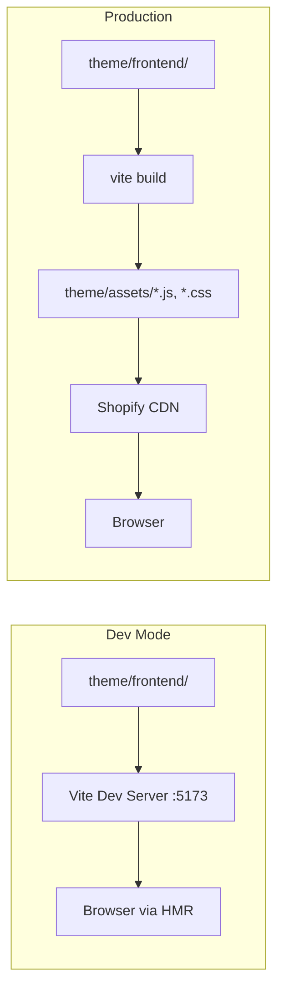

# Build Pipeline

Kona uses [Vite](https://vite.dev) to compile frontend source code into Shopify-compatible assets. Five plugins bridge Vite's module-based build system with Shopify's theme architecture.

## Vite Configuration

The full configuration lives in `vite.config.js` at the project root:

```js
import { defineConfig } from 'vite'
import shopify from 'vite-plugin-shopify'
import shopifyThemeIslands from 'vite-plugin-shopify-theme-islands'
import importMaps from 'vite-plugin-shopify-import-maps'
import tailwindcss from '@tailwindcss/vite'
import cleanup from '@driver-digital/vite-plugin-shopify-clean'

export default defineConfig({
  plugins: [
    shopifyThemeIslands({
      directories: ['/theme/frontend/islands/']
    }),
    shopify({
      versionNumbers: true,
      themeRoot: './theme',
      sourceCodeDir: 'theme/frontend'
    }),
    importMaps({
      themeRoot: './theme',
      bareModules: {
        defaultGroup: '@theme',
        groups: {}
      },
      modulePreload: true
    }),
    cleanup({ themeRoot: './theme' }),
    tailwindcss()
  ],
  build: {
    minify: false,
    emptyOutDir: false,
    rollupOptions: {
      output: {
        entryFileNames: '[name].js',
        chunkFileNames: '[name].js',
        assetFileNames: '[name].[ext]'
      }
    }
  }
})
```

## The Five Plugins

Plugins execute in the order they are listed. Each one handles a specific part of the Shopify-Vite integration.

### 1. `vite-plugin-shopify-theme-islands`

**Purpose:** Island discovery and hydration runtime injection.

- Scans `theme/frontend/islands/` for Web Component files.
- Provides the `vite-plugin-shopify-theme-islands/revive` import that `theme.js` uses.
- At build time, creates the mapping from custom element tag names to island module paths.
- In dev mode, supports HMR for island files.

```js
shopifyThemeIslands({
  directories: ['/theme/frontend/islands/']
})
```

### 2. `vite-plugin-shopify`

**Purpose:** Core Shopify theme integration.

- Discovers entry points from `theme/frontend/entrypoints/` (e.g., `theme.js`, `theme.css`).
- Generates the `vite-tag.liquid` snippet that loads assets in the correct mode (dev server or CDN).
- Reads the Vite build manifest to produce correct asset URLs for production.
- Resolves `sourceCodeDir` for the `@/` and `~/` path aliases.

```js
shopify({
  versionNumbers: true,      // Append ?v= cache busters
  themeRoot: './theme',       // Shopify theme root directory
  sourceCodeDir: 'theme/frontend'  // Where source code lives
})
```

:::warning Auto-generated files
`theme/snippets/vite-tag.liquid` is generated by this plugin. Do not edit it manually -- your changes will be overwritten on the next build or dev server start.
:::

### 3. `vite-plugin-shopify-import-maps`

**Purpose:** ES module import maps for bare module specifiers.

- Generates `theme/snippets/importmap.liquid` containing an `<script type="importmap">` block.
- Allows island files to use bare imports (e.g., `import { debounce } from '@theme/utils'`) that resolve to Shopify CDN URLs in production.
- The `defaultGroup: '@theme'` configuration means bare imports without a group prefix resolve under the `@theme` namespace.
- `modulePreload: true` adds `<link rel="modulepreload">` tags for discovered imports.

```js
importMaps({
  themeRoot: './theme',
  bareModules: {
    defaultGroup: '@theme',
    groups: {}
  },
  modulePreload: true
})
```

:::warning Auto-generated files
`theme/snippets/importmap.liquid` is generated by this plugin. Do not edit it manually.
:::

### 4. `@driver-digital/vite-plugin-shopify-clean`

**Purpose:** Cleans stale build artifacts from `theme/assets/`.

- After a build completes, removes JS and CSS files from previous builds that are no longer in the manifest.
- Preserves non-build files in `theme/assets/` (images, fonts, static files uploaded through Shopify).

```js
cleanup({ themeRoot: './theme' })
```

### 5. `@tailwindcss/vite`

**Purpose:** Tailwind CSS v4 compilation.

- Compiles Tailwind's `@theme`, `@layer`, and `@apply` directives.
- Scans Liquid, JS, and CSS files for utility class usage.
- No `tailwind.config.js` needed -- Tailwind v4 uses CSS-first configuration via the `@theme` block in `theme/frontend/styles/theme.css`.

```js
tailwindcss()
```

## Dev Mode vs. Production

### Development

```bash
pnpm dev -- --store my-store
```

This runs two servers concurrently:

| Server | Port | Purpose |
|--------|------|---------|
| Shopify CLI | 9292 (default) | Proxies the Shopify store, serves Liquid templates |
| Vite | 5173 | Serves frontend assets with HMR |

In dev mode:

- `vite-tag.liquid` outputs `<script>` tags pointing to `http://localhost:5173/...`.
- CSS and JS changes trigger instant hot module replacement -- no full page reload.
- Island file changes hot-reload the individual component.
- Tailwind classes are compiled on the fly.

### Production

```bash
pnpm run build
```

In production:

- Vite bundles all entry points and their dependencies.
- Output goes to `theme/assets/`.
- `vite-tag.liquid` outputs `<script>` and `<link>` tags using Shopify's `asset_url` filter, which resolves to the Shopify CDN.
- The build manifest maps source files to their output filenames.



## Build Output

### Flat Filenames

Vite is configured to output flat filenames without content hashes:

```js
rollupOptions: {
  output: {
    entryFileNames: '[name].js',   // theme.js
    chunkFileNames: '[name].js',   // cart-drawer.js
    assetFileNames: '[name].[ext]' // theme.css
  }
}
```

Shopify's CDN handles cache busting through its own URL versioning, so content hashes in filenames are unnecessary. The `versionNumbers: true` option in `vite-plugin-shopify` appends `?v=` query parameters to asset URLs.

### No Minification

```js
build: {
  minify: false
}
```

Build output is not minified. Shopify's CDN applies its own compression (Brotli/gzip), and unminified code is easier to debug in production.

### Preserved Output Directory

```js
build: {
  emptyOutDir: false
}
```

The `theme/assets/` directory is not emptied before builds. Shopify themes may contain static assets (images, fonts) in this directory that are not managed by Vite. The cleanup plugin handles removing stale _build_ artifacts without touching other files.

## Path Aliases

Two aliases resolve to the same directory:

| Alias | Resolves To |
|-------|-------------|
| `@/` | `theme/frontend/` |
| `~/` | `theme/frontend/` |

Configured in both `jsconfig.json` (for editor intellisense) and handled by Vite through the `sourceCodeDir` option in `vite-plugin-shopify`.

```js
// Both of these import the same module:
import { trapFocus } from '@/lib/a11y'
import { trapFocus } from '~/lib/a11y'
```

## Entry Points

Entry points live in `theme/frontend/entrypoints/` and are automatically discovered by `vite-plugin-shopify`:

| File | Purpose |
|------|---------|
| `theme.js` | Main JS entry -- imports revive runtime and accessibility utilities |
| `theme.css` | Main CSS entry -- imports Tailwind, design tokens, and CSS layers |

The layout file loads both via the `vite-tag` snippet:

```liquid

```
