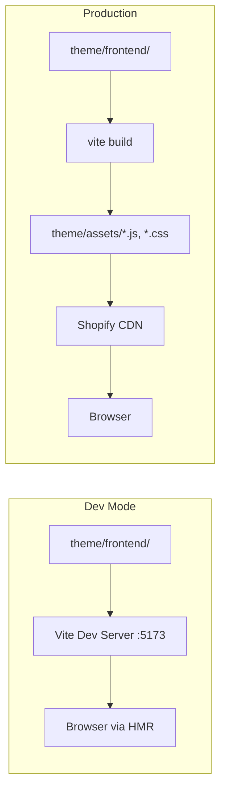

# Build Pipeline

Five Vite plugins bridge Vite's module system with Shopify's theme platform. The full configuration lives in [`vite.config.js`](https://github.com/jonathanmoore/kona-theme/blob/main/vite.config.js).

## The five plugins

Plugins execute in order:

### 1. `vite-plugin-shopify-theme-islands`

Scans `theme/frontend/islands/` for Web Components, provides the `revive` import used by `theme.js`, and maps tag names to module paths at build time.

### 2. `vite-plugin-shopify`

Core Shopify integration. Discovers entry points from `theme/frontend/entrypoints/`, generates `vite-tag.liquid` (which loads assets from the dev server or CDN depending on mode), and resolves the `@/` path alias via `sourceCodeDir`.

### 3. `vite-plugin-shopify-import-maps`

Generates `theme/snippets/importmap.liquid` with an ES module import map. Enables bare imports in islands and adds `<link rel="modulepreload">` for discovered modules.

### 4. `@driver-digital/vite-plugin-shopify-clean`

Removes stale JS/CSS build artifacts from `theme/assets/` after builds, while preserving non-build files (images, fonts).

### 5. `@tailwindcss/vite`

Compiles Tailwind CSS v4. No `tailwind.config.js` needed — configuration is CSS-first via the `@theme` block in `theme/frontend/styles/theme.css`.

::: warning
`vite-tag.liquid` and `importmap.liquid` are auto-generated. Don't edit them — they're overwritten on every build and dev server start.
:::

## Dev mode vs. production



**Development** — `vite-tag.liquid` points `<script>` tags to `localhost:5173`. CSS and JS changes trigger HMR without full page reloads.

**Production** — Vite bundles all entry points. `vite-tag.liquid` outputs tags using Shopify's `asset_url` filter, which resolves to the CDN.

## Build output

**Flat filenames** — Output uses `[name].js` and `[name].[ext]` without content hashes. Shopify's CDN handles cache busting via URL versioning. The `versionNumbers: true` option appends `?v=` query parameters.

**No minification** — `minify: false` keeps source readable for debugging. Shopify's CDN applies Brotli/gzip compression.

**Preserved output directory** — `emptyOutDir: false` because `theme/assets/` contains static assets (images, fonts) not managed by Vite. The cleanup plugin handles stale build artifacts.

## Path aliases

Both `@/` and `~/` resolve to `theme/frontend/`:

```js
import { trapFocus } from '@/lib/a11y'
```

Configured in `jsconfig.json` for editor intellisense and handled by Vite through `sourceCodeDir`.

## Entry points

Entry points in `theme/frontend/entrypoints/` are auto-discovered by `vite-plugin-shopify`:

| File | Purpose |
|------|---------|
| `theme.js` | Imports the revive runtime and accessibility utilities |
| `theme.css` | Imports Tailwind, design tokens, and CSS layers |

Loaded in the layout via:

```liquid

```

## Next steps

- [Project Layout](./project-layout) — Directory structure and file organization
- [Development](/getting-started/development) — The dual-server dev workflow
- [CSS](/assets/css) — Layer system, plugins, and the `@theme` role
