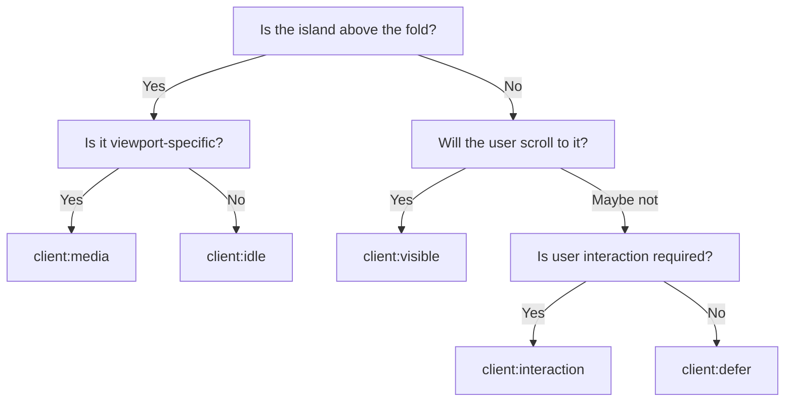

# Hydration Directives

Hydration directives are HTML attributes on custom elements that tell revive _when_ to load an island's JavaScript. Every island needs at least one directive. These directives are provided by [`vite-plugin-shopify-theme-islands`](https://github.com/Rees1993/vite-plugin-shopify-theme-islands).

## Which directive should I use?

| Scenario | Directive |
|----------|-----------|
| Site header, cart drawer — needed early but not at paint | `client:idle` |
| Below-the-fold content — product recommendations, footer features | `client:visible` |
| Viewport-specific — mobile-only nav drawer | `client:media="(max-width: 1023px)"` |
| Low-priority — analytics, non-critical widgets | `client:defer` |
| Inert until engaged — expandable FAQ, tooltip | `client:interaction` |



## Directive reference

| Directive | Syntax | Browser API | Timing |
|-----------|--------|-------------|--------|
| Idle | `client:idle` | [`requestIdleCallback`](https://developer.mozilla.org/en-US/docs/Web/API/Window/requestIdleCallback) | After main thread is free (500ms timeout fallback) |
| Visible | `client:visible` | [`IntersectionObserver`](https://developer.mozilla.org/en-US/docs/Web/API/IntersectionObserver) | Within 200px of the viewport |
| Media | `client:media="(query)"` | [`matchMedia`](https://developer.mozilla.org/en-US/docs/Web/API/Window/matchMedia) | When the media query matches |
| Defer | `client:defer` | `setTimeout` | 2 seconds after page load |
| Interaction | `client:interaction` | Event listeners | On `mouseenter`, `touchstart`, or `focusin` |

### `client:idle`

Loads when the browser's main thread is free. Falls back to a 500ms timeout if `requestIdleCallback` isn't available or hasn't fired.

```liquid
<sticky-header client:idle>
  <!-- Header markup -->
</sticky-header>
```

### `client:visible`

Loads when the element enters (or nears) the viewport. The 200px `rootMargin` starts loading slightly before the element is visible.

```liquid
<product-recommendations client:visible>
  <!-- Recommendations -->
</product-recommendations>
```

### `client:media="(query)"`

Loads only when a CSS media query matches. If the viewport changes to match later, the island loads then.

```liquid
<header-drawer client:media="(max-width: 1023px)">
  <!-- Mobile menu drawer — JS never loads on desktop -->
</header-drawer>
```

The query must include parentheses: `client:media="(max-width: 1023px)"`, not `client:media="max-width: 1023px"`.

### `client:defer`

Loads after a 2-second delay. Good for third-party integrations or components where a slight delay is acceptable.

```liquid
<island-demo-defer client:defer>
  <!-- Low-priority content -->
</island-demo-defer>
```

### `client:interaction`

Loads on first `mouseenter`, `touchstart`, or `focusin`. The triggering event fires _before_ hydration completes, so design the HTML to provide appropriate feedback in the non-hydrated state.

```liquid
<island-demo-interaction client:interaction>
  <!-- Loads on first hover/touch/focus -->
</island-demo-interaction>
```

## Combining directives

An element can have multiple directives. The first condition met triggers the load:

```liquid
<my-island client:visible client:interaction>
  <!-- Loads when visible OR when user interacts — whichever comes first -->
</my-island>
```

## How directives are parsed

Revive reads all `client:*` attributes, sets up listeners for each, triggers the dynamic import on the first one that fires, and cleans up the rest. If no directive is present on a recognized custom element, revive does not hydrate it.

Directives are standard HTML attributes — Liquid passes them through without modification. They work in sections, blocks, and snippets:

```liquid
<variant-radios client:idle {{ block.shopify_attributes }}>
  <!-- Variant radio buttons -->
</variant-radios>
```

## Next steps

- [Islands Architecture](./islands) — How the revive runtime works
- [Creating Islands](/assets/creating-islands) — Build a new island step by step
- [Build Pipeline](./build-pipeline) — How Vite processes islands for production
