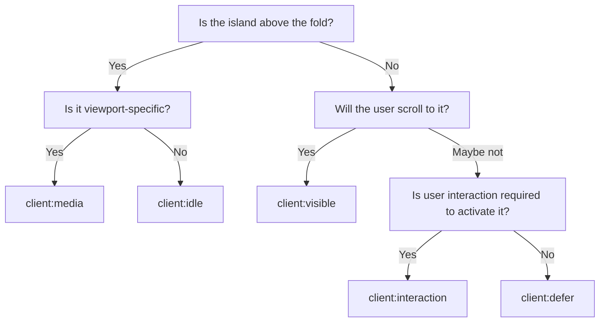

# Hydration Directives

Hydration directives are HTML attributes that tell the revive runtime _when_ to load an island's JavaScript. They are set on custom elements in Liquid templates and control the scheduling strategy for each island.

## Directive Reference

| Directive | Attribute Syntax | Browser API | Default Timing |
|-----------|-----------------|-------------|----------------|
| Idle | `client:idle` | `requestIdleCallback` | After main thread is free (500ms timeout fallback) |
| Visible | `client:visible` | `IntersectionObserver` | When element is within 200px of the viewport |
| Media | `client:media="(query)"` | `matchMedia` | When the media query matches |
| Defer | `client:defer` | `setTimeout` | 2 seconds after page load |
| Interaction | `client:interaction` | Event listeners | On `mouseenter`, `touchstart`, or `focusin` |

## `client:idle`

Loads the island when the browser's main thread is idle, using `requestIdleCallback`. If the browser does not support `requestIdleCallback` or the callback has not fired within 500ms, a timeout fallback triggers the load.

**Best for:** Components that need to be ready soon but are not in the critical rendering path.

```liquid
<sticky-header client:idle>
  <!-- Header markup -->
</sticky-header>
```

```liquid
<cart-drawer client:idle>
  <!-- Cart drawer markup -->
</cart-drawer>
```

:::tip When to use `client:idle`
Use this for components the user is likely to interact with early in the session but that do not need to be interactive the instant the page paints. Header menus, cart drawers, and form enhancements are good candidates.
:::

## `client:visible`

Loads the island when the element enters (or is about to enter) the viewport, using `IntersectionObserver` with a `rootMargin` of `200px`. The 200px margin means the island starts loading slightly before it becomes visible, reducing perceived latency.

**Best for:** Below-the-fold content that should only load when the user scrolls near it.

```liquid
<product-recommendations client:visible>
  <!-- Recommendations placeholder or server-rendered content -->
</product-recommendations>
```

:::info Root margin
The 200px `rootMargin` provides a buffer zone. An element 200px below the fold will begin loading before the user scrolls it into view. This balances bandwidth savings with perceived performance.
:::

## `client:media="(query)"`

Loads the island only when a CSS media query matches, using `matchMedia`. The query string is passed as the attribute value. If the viewport changes and the query begins matching later, the island loads at that point.

**Best for:** Components that are only relevant at certain viewport sizes, like mobile-only menus or desktop-only features.

```liquid
<header-drawer client:media="(max-width: 1023px)">
  <!-- Mobile menu drawer -->
</header-drawer>
```

This island's JavaScript is never loaded on desktop viewports wider than 1023px, saving bandwidth and execution time.

```liquid
<island-demo-media-mobile client:media="(max-width: 767px)">
  <!-- Only hydrates on mobile -->
</island-demo-media-mobile>
```

:::warning Query string format
The media query must include the parentheses. Write `client:media="(max-width: 1023px)"`, not `client:media="max-width: 1023px"`.
:::

## `client:defer`

Loads the island after a fixed delay using `setTimeout`. The default delay is 2 seconds.

**Best for:** Low-priority components that enhance the experience but are not needed immediately.

```liquid
<island-demo-defer client:defer>
  <!-- Content that enhances after delay -->
</island-demo-defer>
```

:::tip
`client:defer` is useful for third-party integrations, analytics widgets, or any component where a slight delay is acceptable to prioritize critical content.
:::

## `client:interaction`

Loads the island when the user first interacts with it, listening for `mouseenter`, `touchstart`, and `focusin` events. The island loads on the first event that fires; subsequent events are handled by the hydrated component.

**Best for:** Components that are entirely inert until user engagement, like expandable details, tooltips, or lazy-loaded forms.

```liquid
<island-demo-interaction client:interaction>
  <!-- Interactive content that loads on first hover/touch/focus -->
</island-demo-interaction>
```

:::info First interaction
The initial triggering event (e.g., the first `mouseenter`) causes the island to load. The island may not be hydrated in time to handle that specific event. Design the HTML so that the non-hydrated state provides appropriate visual feedback.
:::

## Decision Guide

Use this flowchart to choose the right directive:



### Quick reference

| Scenario | Directive |
|----------|-----------|
| Site header, cart drawer | `client:idle` |
| Product recommendations below the fold | `client:visible` |
| Mobile-only navigation drawer | `client:media="(max-width: 1023px)"` |
| Non-critical widget, analytics | `client:defer` |
| Expandable FAQ, tooltip | `client:interaction` |

## Combining Directives

An element can have multiple hydration directives. The first directive whose condition is met triggers the load. This allows "race" semantics:

```liquid
<my-island client:visible client:interaction>
  <!-- Loads when visible OR when user interacts, whichever comes first -->
</my-island>
```

This is useful for elements that are below the fold (so `client:visible` is appropriate) but might receive early interaction from fast scrollers or keyboard navigation.

## How Directives Are Parsed

When revive encounters a custom element:

1. It reads all attributes starting with `client:`.
2. For each directive, it sets up the corresponding browser API listener.
3. The first listener that fires triggers the dynamic import.
4. All other listeners for that element are cleaned up.

If no `client:` directive is present on a recognized custom element, revive does not automatically hydrate it. Every island needs at least one directive to tell revive when to load it.

## Directive Attributes in Shopify

Hydration directives are standard HTML attributes. Shopify's Liquid engine passes them through without modification since they are not Liquid syntax. They work in sections, blocks, and snippets:

```liquid
 In a snippet 
<variant-radios client:idle {{ block.shopify_attributes }}>
  <!-- Variant radio buttons -->
</variant-radios>
```

```liquid
 In a section 
<product-recommendations client:visible data-url="{{ routes.product_recommendations_url }}">
  <!-- Recommendations -->
</product-recommendations>
```
