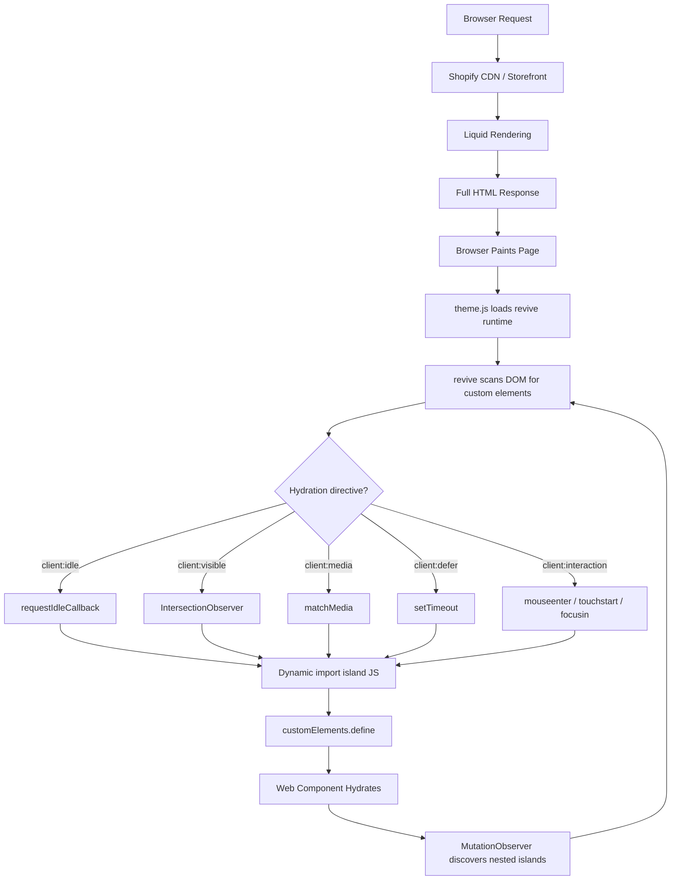

# Architecture Overview

Kona is a Vite-powered Shopify OS 2.0 theme built on an **islands architecture** inspired by [Astro](https://astro.build). The core idea: Liquid renders complete HTML on the server, and only the interactive parts of the page receive JavaScript through selective hydration.

## The Three Layers

### 1. Server Rendering (Liquid)

Shopify's Liquid templating engine renders every page to full HTML on the server. The browser receives a complete document -- text, images, layout -- before any JavaScript executes. This means pages are fast and functional even with JS disabled.

### 2. Build Pipeline (Vite)

Vite compiles frontend source code (`theme/frontend/`) into production assets (`theme/assets/`). In development, Vite serves assets with hot module replacement at `localhost:5173`. In production, built files are served from the Shopify CDN. Five Vite plugins coordinate the integration between Vite and Shopify.

### 3. Client Hydration (Islands)

Interactive components are implemented as Web Components (custom elements) that hydrate on the client. The hydration runtime from `vite-plugin-shopify-theme-islands` scans the DOM for custom elements, matches them to island files, and loads them based on **hydration directives** that control _when_ each component's JavaScript is fetched.

## Request Lifecycle



## How the Pieces Connect

The layout file `theme/layout/theme.liquid` loads two entry points via auto-generated snippets:

- **`theme.css`** -- Tailwind CSS v4 with the full design system
- **`theme.js`** -- Imports the revive runtime and accessibility utilities

In development, the `vite-tag` snippet points `<script>` and `<link>` tags to the Vite dev server (`localhost:5173`). In production, it references hashed URLs from Vite's build manifest, served by the Shopify CDN.

Sections and snippets render custom elements with hydration directives:

```liquid
<header-drawer client:media="(max-width: 1023px)">
  <details>
    <!-- Full HTML markup, functional without JS -->
  </details>
</header-drawer>
```

The revive runtime sees `<header-drawer>`, finds a matching file at `theme/frontend/islands/header-drawer.js`, checks the `client:media` directive, and dynamically imports the island when the media query matches.

## Zero Runtime Dependencies

Every dependency in `package.json` is a `devDependency`. No npm packages ship to the browser. All interactivity is vanilla Web Components using platform APIs: `customElements.define`, `IntersectionObserver`, `AbortController`, `CustomEvent`, and standard DOM methods.

## Architecture Deep Dives

| Page | What It Covers |
|------|---------------|
| [Islands Architecture](./islands) | How partial hydration works, the revive runtime, progressive enhancement, nested islands |
| [Hydration Directives](./hydration-directives) | The 5 directives that control when islands load, with usage guidance |
| [Build Pipeline](./build-pipeline) | Vite config, the 5 plugins, dev vs. production modes, import maps |
| [Project Layout](./project-layout) | Directory structure, file organization, auto-generated files |
