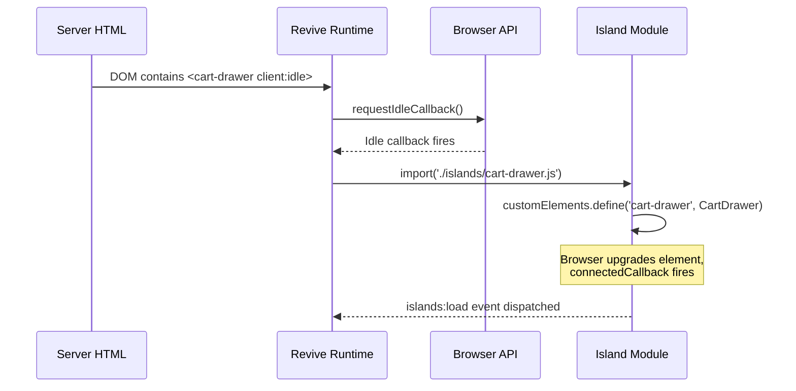

# Islands Architecture

Liquid renders complete HTML on the server. Only the interactive parts of the page — the "islands" — receive JavaScript. Each island hydrates independently, on its own schedule, with its own module.

This is [partial hydration](https://docs.astro.build/en/concepts/islands/), adapted for Shopify. Where Astro uses its own compiler and supports multiple frameworks, Kona uses Liquid for server rendering, [Web Components](https://developer.mozilla.org/en-US/docs/Web/API/Web_components) for client interactivity, and [`vite-plugin-shopify-theme-islands`](https://github.com/Rees1993/vite-plugin-shopify-theme-islands) by Alex Rees for hydration orchestration. The plugin provides the revive runtime, the `client:*` directive syntax (which mirrors [Astro's API](https://docs.astro.build/en/reference/directives-reference/#client-directives)), and the dynamic import machinery that ties it all together.

## How revive works

The hydration runtime is imported in the main entry point:

```js
// theme/frontend/entrypoints/theme.js
import 'vite-plugin-shopify-theme-islands/revive'
```

When revive initializes:

1. **Scans the DOM** for custom elements whose tag names match files in `theme/frontend/islands/`. `<cart-drawer>` maps to `cart-drawer.js`.
2. **Reads directives** — each element's `client:*` attributes determine when to load (`client:idle`, `client:visible`, `client:media`, `client:defer`, `client:interaction`).
3. **Waits for the condition** — a `client:visible` island only loads when it scrolls into view.
4. **Dynamically imports** the island module, which calls `customElements.define()`. The browser upgrades the element in place and fires `connectedCallback`.



## Dynamic content and nested islands

Revive uses a [`MutationObserver`](https://developer.mozilla.org/en-US/docs/Web/API/MutationObserver) to watch for custom elements added after initial page load. This handles section rendering in the theme editor, AJAX content (cart updates, search results), and nested islands.

Islands can contain other islands. When a parent hydrates and renders child custom elements, the observer detects them and queues them for hydration. No manual registration is needed.

If a dynamic import fails, revive retries with exponential backoff for resilience against transient network errors.

## Runtime events

Revive dispatches events on `document` for monitoring:

**`islands:load`** — Fired when an island hydrates successfully.

```js
document.addEventListener('islands:load', (event) => {
  const { tag, duration, attempt } = event.detail
  console.log(`${tag} hydrated in ${duration}ms (attempt ${attempt})`)
})
```

**`islands:error`** — Fired when an island fails after all retry attempts.

```js
document.addEventListener('islands:error', (event) => {
  console.error(`Failed to load island: ${event.detail.tag}`)
})
```

## Progressive enhancement

Because Liquid renders complete HTML, every component works before JavaScript loads. Islands _enhance_ the base experience:

| Component | Without JS | With JS |
|-----------|-----------|---------|
| Header drawer | `<details>`/`<summary>` toggles natively | Smooth animation, focus trap, overlay |
| Variant picker | Radio buttons submit the form | Updates price and URL without reload |
| Cart form | Standard form submits to `/cart` | AJAX add-to-cart, drawer opens with live update |
| Sticky header | Static header at top | Hides on scroll down, reveals on scroll up |

The HTML _is_ the product. JavaScript adds refinements.

## Anatomy of an island

### Liquid snippet

```liquid
<sticky-header client:idle>
  <header id="shopify-section-header">
    <!-- Full header markup rendered by Liquid -->
  </header>
</sticky-header>
```

### Island JavaScript

```js
// theme/frontend/islands/sticky-header.js

class StickyHeader extends window.HTMLElement {
  connectedCallback() {
    this.controller = new AbortController()
    this.header = document.getElementById('shopify-section-header')
    this.headerBounds = {}

    window.addEventListener('scroll', this.onScroll.bind(this), {
      signal: this.controller.signal
    })

    this.createObserver()
  }

  disconnectedCallback() {
    this.controller?.abort()
  }

  createObserver() {
    const observer = new IntersectionObserver((entries, observer) => {
      this.headerBounds = entries[0].intersectionRect
      observer.disconnect()
    })
    observer.observe(this.header)
  }

  onScroll() {
    // Show/hide header based on scroll direction
  }
}

window.customElements.define('sticky-header', StickyHeader)
```

Key patterns:

- **`connectedCallback`** sets up event listeners with `AbortController` for cleanup
- **`disconnectedCallback`** calls `this.controller.abort()` to remove all listeners
- **`customElements.define`** at the bottom registers the element — called once on import, the browser upgrades all matching elements
- **No constructor DOM access** — DOM queries happen in `connectedCallback`, not the constructor

## Naming convention

The filename maps directly to the custom element tag name:

| File | Tag |
|------|-----|
| `cart-drawer.js` | `<cart-drawer>` |
| `product-form.js` | `<product-form>` |
| `sticky-header.js` | `<sticky-header>` |

Custom element names [must contain a hyphen](https://developer.mozilla.org/en-US/docs/Web/API/CustomElementRegistry/define) — this is a web platform requirement.

## Component inheritance

Some islands share behavior through class inheritance. `DetailsModal` is a base class providing open/close, focus trap, and overlay behavior:

```
details-modal.js (base class)
  ├── header-drawer.js
  └── password-modal.js
```

## Next steps

- [Hydration Directives](./hydration-directives) — Choose when each island loads
- [Creating Islands](/assets/creating-islands) — Build your first island step by step
