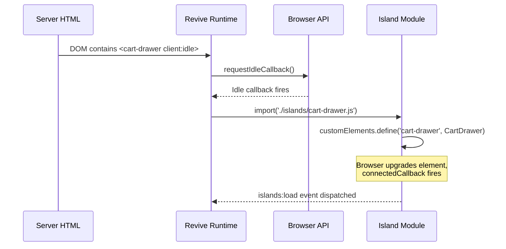

# Islands Architecture

The islands architecture is the defining pattern of Kona. Instead of shipping a JavaScript framework that controls the entire page, only the interactive "islands" on a page receive JavaScript. Everything else is static HTML rendered by Liquid on the server.

## What Islands Architecture Means

In a traditional SPA, the framework owns the entire page. The server sends a minimal HTML shell, and JavaScript builds the UI. In an islands architecture, the relationship is inverted:

- The **server** owns the page. Liquid renders complete, functional HTML.
- **Islands** are isolated regions of interactivity embedded within that HTML.
- Each island hydrates independently, on its own schedule, with its own JavaScript bundle.

This is sometimes called **partial hydration** -- only the parts of the page that need interactivity receive client-side JavaScript. A product page might have a static description, static images, and three islands: a variant picker, an add-to-cart form, and a sticky header. Only those three components load JS.

### Astro Inspiration

Kona's approach is directly inspired by [Astro's islands](https://docs.astro.build/en/concepts/islands/), adapted for the Shopify ecosystem. Where Astro uses its own compiler and supports multiple frameworks, Kona uses:

- **Liquid** instead of Astro components for server rendering
- **Web Components** instead of React/Vue/Svelte for client interactivity
- **`vite-plugin-shopify-theme-islands`** instead of Astro's compiler for hydration orchestration

The hydration directive syntax (`client:idle`, `client:visible`, etc.) mirrors Astro's API.

## How Revive Works

The hydration runtime is provided by the `vite-plugin-shopify-theme-islands` package and imported in the main entry point:

```js
// theme/frontend/entrypoints/theme.js
import 'vite-plugin-shopify-theme-islands/revive'
```

When revive initializes, it performs the following sequence:

### 1. DOM Scanning

Revive scans the document for custom elements whose tag names match files in `theme/frontend/islands/`. A tag like `<cart-drawer>` maps to `theme/frontend/islands/cart-drawer.js`. The mapping is kebab-case tag name to filename.

### 2. Directive Evaluation

For each discovered element, revive reads the hydration directive attributes (`client:idle`, `client:visible`, `client:media`, `client:defer`, `client:interaction`). See [Hydration Directives](./hydration-directives) for details on each one.

### 3. Conditional Loading

Rather than importing all island code upfront, revive waits for the directive's condition to be met. A `client:visible` island only loads when it scrolls into view. A `client:media="(max-width: 1023px)"` island only loads on matching viewports.

### 4. Dynamic Import and Registration

Once the condition triggers, revive dynamically imports the island module. The module calls `customElements.define()` to register the Web Component, and the browser upgrades the element in place -- the existing HTML is preserved and the component's `connectedCallback` fires.



## MutationObserver for Dynamic Content

Revive uses a `MutationObserver` to watch for custom elements added to the DOM after initial page load. This handles:

- **Shopify section rendering** -- When the theme editor adds or reorders sections, new custom elements may appear.
- **AJAX content** -- Cart drawer updates, search results, and other dynamically injected HTML can contain islands.
- **Nested islands** -- A parent island that renders child custom elements in its `connectedCallback` (see below).

No manual registration is required. Any custom element matching an island file is automatically discovered and hydrated.

## Nested Islands

Islands can contain other islands. When a parent island hydrates and renders HTML containing child custom elements, the MutationObserver detects the new elements and queues them for hydration.

For example, `<cart-drawer>` might render `<cart-drawer-items>` and `<cart-remove-button>` elements inside its template. These child islands are discovered after the parent hydrates and renders its content.

:::warning
Nested islands are discovered only after the parent finishes hydrating. If a parent island has `client:idle` and a child has `client:visible`, the child will not begin observing visibility until the parent has loaded and rendered the child element into the DOM.
:::

## Retry with Backoff

If a dynamic import fails (due to a network error, for example), revive retries with exponential backoff. This provides resilience against transient failures without requiring manual intervention.

## Runtime Events

The revive runtime dispatches custom events on the `document` to enable monitoring and debugging:

### `islands:load`

Fired when an island successfully hydrates.

```js
document.addEventListener('islands:load', (event) => {
  const { tag, duration, attempt } = event.detail
  console.log(`${tag} hydrated in ${duration}ms (attempt ${attempt})`)
})
```

| Property | Type | Description |
|----------|------|-------------|
| `tag` | `string` | The custom element tag name (e.g., `'cart-drawer'`) |
| `duration` | `number` | Time in milliseconds from trigger to hydration complete |
| `attempt` | `number` | Which attempt succeeded (1 = first try, higher = after retries) |

### `islands:error`

Fired when an island fails to load after all retry attempts.

```js
document.addEventListener('islands:error', (event) => {
  console.error(`Failed to load island: ${event.detail.tag}`)
})
```

## Progressive Enhancement

Because Liquid renders complete HTML on the server, every component is functional before JavaScript loads. Islands _enhance_ the base experience rather than creating it:

| Component | Without JS | With JS |
|-----------|-----------|---------|
| Header drawer | `<details>`/`<summary>` toggles natively | Smooth slide animation, focus trap, overlay |
| Variant picker | Radio buttons submit the form | Updates price, availability, and URL without page reload |
| Cart form | Standard form submission to `/cart` | AJAX add-to-cart, drawer opens with live update |
| Sticky header | Static header at top of page | Hides on scroll down, reveals on scroll up |

This is not graceful degradation (building the full experience then stripping it back). The HTML _is_ the product. JavaScript adds refinements.

## Anatomy of an Island

An island is a standard Web Component in a file under `theme/frontend/islands/`. Here is a minimal example:

### Liquid Snippet

```liquid

  Renders a sticky header that hides on scroll down and reveals on scroll up.


<sticky-header client:idle>
  <header id="shopify-section-header">
    <!-- Full header markup rendered by Liquid -->
  </header>
</sticky-header>
```

The `client:idle` attribute tells revive to load the island when the main thread is free.

### Island JavaScript

```js
// theme/frontend/islands/sticky-header.js

class StickyHeader extends window.HTMLElement {
  connectedCallback() {
    this.controller = new AbortController()
    this.header = document.getElementById('shopify-section-header')
    this.headerBounds = {}
    this.currentScrollTop = 0

    window.addEventListener('scroll', this.onScroll.bind(this), {
      signal: this.controller.signal
    })

    this.createObserver()
  }

  disconnectedCallback() {
    this.controller?.abort()
  }

  createObserver() {
    const observer = new IntersectionObserver((entries, observer) => {
      this.headerBounds = entries[0].intersectionRect
      observer.disconnect()
    })
    observer.observe(this.header)
  }

  onScroll() {
    // Show/hide header based on scroll direction
  }
}

window.customElements.define('sticky-header', StickyHeader)
```

Key patterns:

- **`connectedCallback`** sets up event listeners with `AbortController` for cleanup.
- **`disconnectedCallback`** calls `this.controller.abort()` to remove all listeners.
- **`customElements.define`** at the bottom registers the element. This is called once when the module is imported; the browser then upgrades all matching elements.
- **No constructor DOM access** -- DOM queries happen in `connectedCallback`, not the constructor, because the element's children are not available in the constructor.

## Naming Convention

The filename determines the custom element tag name through a direct kebab-case mapping:

| File | Tag |
|------|-----|
| `cart-drawer.js` | `<cart-drawer>` |
| `product-form.js` | `<product-form>` |
| `sticky-header.js` | `<sticky-header>` |
| `variant-radios.js` | `<variant-radios>` |

Custom element names must contain a hyphen (this is a Web Components requirement, not a Kona convention).

## Component Inheritance

Some islands share behavior through class inheritance. `DetailsModal` is a base class that provides open/close, focus trap, and overlay behavior:

```
details-modal.js (base class)
  ├── header-drawer.js (extends DetailsModal)
  └── password-modal.js (extends DetailsModal)
```

This keeps shared modal logic in one place while allowing each component to customize its behavior.
